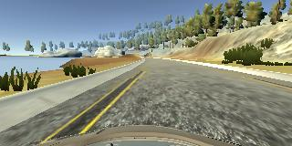
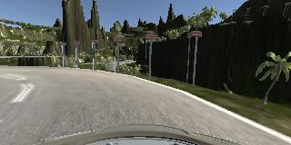

# Behaviorial Cloning Project

[](http://www.udacity.com/drive)

The Project
---
The goals / steps of this project are the following:
* Use the simulator to collect data of good driving behavior 
* Design, train and validate a model that predicts a steering angle from image data
* Use the model to drive the vehicle autonomously around the first track in the simulator. The vehicle should remain on the road for an entire loop around the track.
* Summarize the results with a written report

### Dependencies
This lab requires:

* [CarND Term1 Starter Kit](https://github.com/udacity/CarND-Term1-Starter-Kit)

The lab enviroment can be created with CarND Term1 Starter Kit. Click [here](https://github.com/udacity/CarND-Term1-Starter-Kit/blob/master/README.md) for the details.

### Solution design

In my solution I used the [NVIDIA's CNN](https://devblogs.nvidia.com/deep-learning-self-driving-cars/). It consists of 9 layers, including a normalization layer, 5 convolutional layers, and 3 fully connected layers. The only difference is that is used RGB color space and the original image size which comes from the simulator.


In order to avoid overfitting I added dropout layers between each convolutional layers. The dropout coefficient is 0.2.

After training the model I tried it on the first track, but it wasn't able to drive around sharp corners. To improve the model's behavior I added more left and right side recovery data, which helped the model to drive around sharp corners .

As a result, the model is able to drive the car around the first track without mistakes and with several mistakes around the second track.

### Final model architecture

Here is a visualization of the architecture of the final model:


### Creation of the training dataset

The most interesting part of this project was to capture the training data. I was capturing the data in 5 steps:

* Center lane driving (first track);
* Reverse direction center lane driving (first track);
* Two laps of left and right side recovery driving (first track);
* Right lane driving (second track);
* Reverse direction right lane driving (second track).

Examples of training data can be found below.

* Center lane driving

	

* Recovery driving

	

	

	

* Second track right lane driving

	

	

In order to augment data set I used the images from left and right cameras with the steering angle values which were added with the adjusting factor (+0.2 for left and -0.2 for right).
 
* Left and right cameras images:

	

	

Additionally, each image and steering angle value were flipped to get more training data:

* Flipped images:

	

	

After the collection process, I had 60000 number of data points. Recovery data was checked manually using my tool which outputs current image with current steering angle and allows to delete this data portion from the data set.

Data_cleaner tool can be used on the data set generated by the simulator. There must be the driving_log.csv file and the IMG folder in directory that you passes to the script:

```sh
python data_cleaner.py ./data/
```

After the whole data set checked, driving_log_edited.csv file will be generated and all unnecessary images deleted.