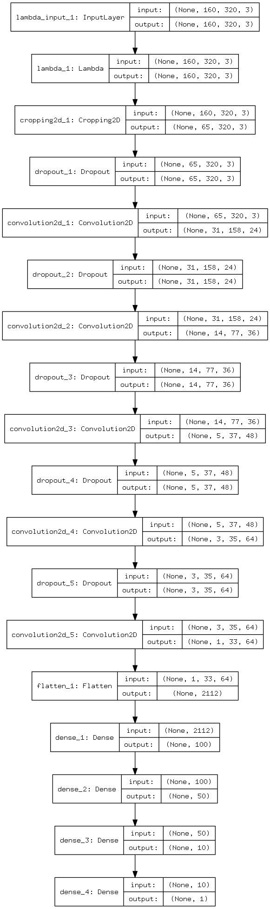
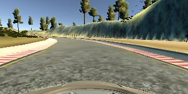
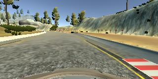
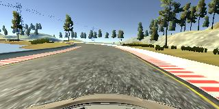
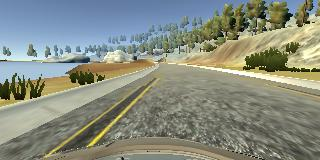
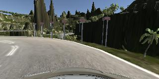
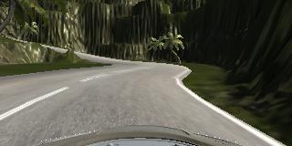
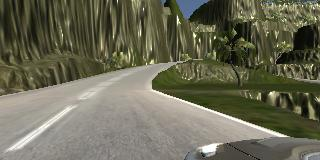
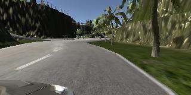
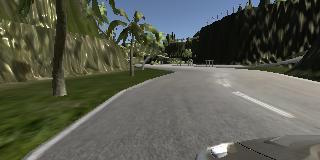

# **Behavioral Cloning** 

---

**Behavioral Cloning Project**

The goals / steps of this project are the following:

* Use the simulator to collect data of good driving behavior
* Build, a convolution neural network in Keras that predicts steering angles from images
* Train and validate the model with a training and validation set
* Test that the model successfully drives around track one without leaving the road
* Summarize the results with a written report

## Rubric Points
### Here I will consider the [rubric points](https://review.udacity.com/#!/rubrics/432/view) individually and describe how I addressed each point in my implementation.  

---
### Files Submitted & Code Quality

#### 1. Submission includes all required files and can be used to run the simulator in autonomous mode

My project includes the following files:

* model.py containing the script to create and train the model
* drive.py for driving the car in autonomous mode
* model.h5 containing a trained convolution neural network 
* writeup_report.md or writeup_report.pdf summarizing the results

#### 2. Submission includes functional code
Using the Udacity provided simulator and my drive.py file, the car can be driven autonomously around the track by executing 
```sh
python drive.py model.h5
```

#### 3. Submission code is usable and readable

The model.py file contains the code for training and saving the convolution neural network. The file shows the pipeline I used for training and validating the model.

### Model Architecture and Training Strategy

#### 1. An appropriate model architecture has been employed

In my solution I used the [NVIDIA's CNN](https://devblogs.nvidia.com/deep-learning-self-driving-cars/). It consists of 9 layers, including a normalization layer, 5 convolutional layers, and 3 fully connected layers. The only difference is that is used RGB color space and the original image size which comes from the simulator.

#### 2. Attempts to reduce overfitting in the model

Also, to avoid overfitting I added dropout layers with dropout coefficient of 0.2 between convolutional layers.

To ensure that the model was not overfitting I splitted my data set to training and validation sets. After training the model was tested in the simulator.

#### 3. Model parameter tuning

The model used an adam optimizer, so the learning rate was not tuned manually.

#### 4. Appropriate training data

Training data was chosen to keep the vehicle driving on the road. I used a combination of center lane driving, recovering from the left and right sides of the road ... 

For details about how I created the training data, see the next section. 

### Model Architecture and Training Strategy

#### 1. Solution Design Approach

As the first step I took the CNN that NVIDIA uses in their self-driving car. This model is appropriate because it solves the same task and it makes possible to try it in current project.

In order to avoid overfitting I added dropout layers between each convolutional layers. The dropout coefficient is 0.2.

After training the model I tried it on the first track, but it wasn't able to drive around sharp corners. To improve the model's behavior I added more left and right side recovery data, which helped the model to drive around sharp corners .

As a result, the model is able to drive the car around the first track without mistakes and with several mistakes around the second track.

#### 2. Final Model Architecture

Here is a visualization of the architecture of the final model:



#### 3. Creation of the Training Set & Training Process

The most interesting part of this project was to capture the training data. I was capturing the data in 5 steps:

* Center lane driving (first track);
* Reverse direction center lane driving (first track);
* Two laps of left and right side recovery driving (first track);
* Right lane driving (second track);
* Reverse direction right lane driving (second track).

Examples of training data can be found below.

* Center lane driving

	

* Recovery driving

	

	

	

* Second track right lane driving

	

	

In order to augment data set I used the images from left and right cameras with the steering angle values which were added with the adjusting factor (+0.2 for left and -0.2 for right).
 
Here's the example of left and right cameras images:

	
	

Additionally, each image and steering angle value were flipped to get more training data:

	
	

After the collection process, I had 60000 number of data points. Recovery data was checked manually using my tool which outputs current image with current steering angle and allows to delete this data portion from the data set.